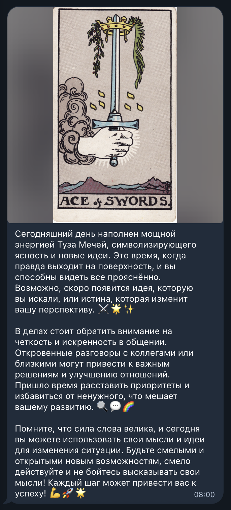
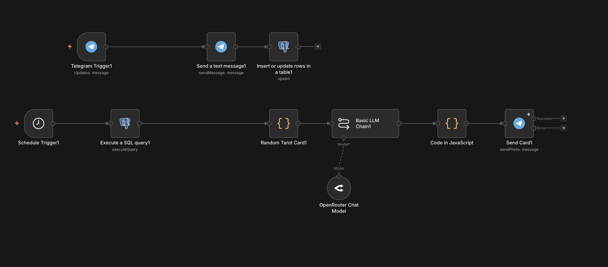
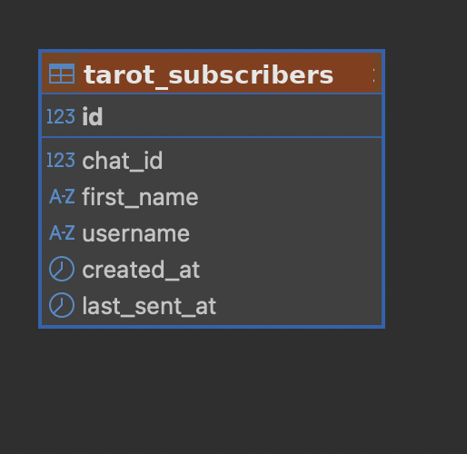

# 🔮 Daily Tarot Card Bot

Telegram bot that sends a random daily tarot card every morning with an image, meaning, and short reflection.

> This project is for entertainment and self-reflection purposes only. It does not provide professional, medical, legal, financial, or psychological advice.

## 🇬🇧 Short Description

**Daily Tarot Card Bot** is a simple Telegram automation project.

Every morning, the bot selects a random tarot card, sends the card image, explains the meaning, and gives the user a short reflection for the day.

The project is designed as a portfolio-ready automation template built with **Telegram Bot API, n8n, PostgreSQL, and scheduled workflows**.

---

## 🇷🇺 Краткое описание

**Daily Tarot Card Bot** — это простой Telegram-бот с ежедневной картой Таро.

Каждое утро бот выбирает случайную карту, отправляет изображение, краткое значение карты и небольшой совет дня.

Проект подготовлен как портфолио-шаблон автоматизации на базе **Telegram Bot API, n8n, PostgreSQL и scheduled workflows**.

---

## 🖼️ Demo Screenshots

### Daily tarot card message



### n8n workflow overview



### PostgreSQL subscribers table



More details: [`docs/demo-screenshots.md`](docs/demo-screenshots.md)

---

## ✨ Features

- Daily scheduled tarot card delivery
- Random card selection
- Card image + caption
- Short meaning and reflection
- PostgreSQL user and delivery history
- Safe demo configuration
- No payments or subscriptions
- No personal predictions stored publicly

---

## 🧩 Architecture

```text
Schedule Trigger
        ↓
Select Active Users
        ↓
Pick Random Tarot Card
        ↓
Load Card Image + Meaning
        ↓
Send Telegram Photo + Caption
        ↓
Save Delivery History
```

More details: [`docs/architecture.md`](docs/architecture.md)

---

## 🛠️ Tech Stack

- Telegram Bot API
- n8n
- PostgreSQL
- Scheduled workflow
- JSON card dataset
- Image URLs / local assets

---

## 📁 Repository Structure

```text
daily-tarot-card-bot/
├── README.md
├── LICENSE
├── .gitignore
├── .env.example
├── docs/
│   ├── architecture.md
│   ├── setup-checklist.md
│   ├── security.md
│   ├── legal-disclaimer.md
│   ├── demo-screenshots.md
│   └── screenshots/
│       ├── 01-daily-card-message.png
│       ├── 02-n8n-workflow.png
│       └── 03-postgresql-subscribers.png
├── sql/
│   ├── 001_schema.sql
│   ├── 002_demo_data.sql
│   └── 003_queries.md
├── n8n/
│   ├── workflow-notes.md
│   └── workflow-placeholder.json
├── bot/
│   ├── telegram-message-examples.md
│   └── tarot-cards-demo.json
└── assets/
    └── README.md
```

---

## ⚙️ Setup Outline

1. Create a Telegram bot.
2. Create PostgreSQL database.
3. Run SQL schema.
4. Import the n8n workflow locally.
5. Configure Telegram credentials locally.
6. Configure the schedule trigger.
7. Add active users.
8. Test daily card delivery.

---

## 🔐 Security Notes

Never commit:

- Telegram bot token
- real `chat_id` values
- real `user_id` values
- `.env` files with real values
- n8n credentials
- production webhook URLs
- private user messages

Use `.env.example` with placeholders only.

See: [`docs/security.md`](docs/security.md)

---

## ⚖️ Disclaimer

This bot is for entertainment and self-reflection only.

It does not provide professional, medical, legal, financial, psychological, or spiritual guarantees.

See: [`docs/legal-disclaimer.md`](docs/legal-disclaimer.md)

---

## 📌 Project Tagline

**English:**  
Telegram bot that sends a random daily tarot card with an image, meaning and short reflection.

**Russian:**  
Telegram-бот, который каждое утро отправляет случайную карту Таро с картинкой, значением и коротким советом дня.

Maintenance note: verify every active demo card has both a readable caption and a usable image fallback.

Maintenance note: confirm disabled subscribers are excluded immediately before each scheduled send.

Maintenance note: confirm demo image URLs remain reachable before portfolio demonstrations.

Maintenance note: verify the documented delivery time uses an explicit timezone to avoid daylight-saving drift.

Maintenance note: verify a retried scheduled run does not send a second daily card to users already marked delivered.

Maintenance note: confirm delivery history records failures separately from successful sends for easier retry checks.

Maintenance note: verify retry logic targets only failed deliveries and never resends previously successful ones.

Maintenance note: test schedule changes with a demo subscriber before applying a new delivery timezone to production.

Maintenance note: keep a text-only fallback ready so a broken card image does not block the daily message.

Maintenance note: confirm each demo card ID is unique and maps to exactly one caption and image reference.

Maintenance note: keep documented card dataset paths synchronized with the current demo asset layout.

Maintenance note: confirm demo subscriber screenshots use synthetic IDs and names only before portfolio publication.

Maintenance note: verify every referenced demo card asset exists before recording screenshots or publishing examples.

Maintenance note: confirm overlapping schedule triggers cannot deliver two cards to the same demo subscriber for one local calendar day.

Maintenance note: verify a timezone change does not shift the same subscriber into two sends within one local date.

Maintenance note: validate the demo card dataset parses cleanly and contains no duplicate normalized card names before publishing a new portfolio build.

Maintenance note: compare the final demo batch summary with delivery-history totals before capturing portfolio screenshots.

Maintenance note: confirm a freshly reset demo delivery history starts at zero successful sends before the next scheduled portfolio test.

Maintenance note: verify the delivery store enforces at most one successful card record per subscriber and local calendar date.

Maintenance note: after a scheduled demo run, verify the reported success/failure totals exactly match the persisted delivery-history rows.

Maintenance note: verify a synthetic dry-run with an unavailable image fallback records a safe failure without creating a success-history row.

Maintenance note: reconcile an ambiguous provider result against the original delivery identity before any retry is attempted.

Maintenance note: persist the delivery identity before sending so a restart can reuse the same idempotency key instead of issuing a blind second delivery.

Maintenance note: match provider acknowledgement to the stored delivery identity and idempotency key; reconcile timeouts before retrying the same subscriber and local date.

Maintenance note: verify a recovered delivery keeps one success record and one user-visible card for each subscriber and local date.

Maintenance note: verify a retry after an ambiguous delivery result produces one visible card and one success record per subscriber/date.

Maintenance note: verify recovery reuses the original provider delivery identity before retrying an ambiguous result.

Maintenance note: verify one provider acknowledgement produces one success record per subscriber and local date after recovery.

Maintenance note: verify an ambiguous provider acknowledgement is reconciled against subscriber and local-date identity before retry.

Maintenance note: verify a provider timeout is reconciled before retry so one subscriber/date receives only one visible card.

Maintenance note: verify a subscriber crossing a timezone date boundary receives exactly one card for each resolved local date.

Maintenance note: verify a permanent blocked-user response disables further delivery attempts without creating a retry loop.

Maintenance note: verify concurrent scheduler workers cannot create duplicate delivery intents for the same subscriber and local date.

Maintenance note: verify invalid or missing subscriber timezone data falls back deterministically without creating duplicate daily deliveries.

Maintenance note: document the local-time boundary used to decide whether today's card has already been delivered after a restart.

Maintenance note: document when delivery is recorded relative to Telegram acknowledgement so retries cannot duplicate a daily card.

Maintenance note: document how blocked users are removed from active delivery attempts while preserving non-sensitive delivery history.

Maintenance note: document the scheduler-lock strategy that prevents duplicate daily deliveries when multiple workers start.

Maintenance note: document delivery behavior across daylight-saving transitions and other local timezone offset changes.

Maintenance note: document aggregate reporting for partial delivery failures without exposing subscriber identifiers.

Maintenance note: verify a content-generation timeout never marks the daily card as delivered before a message is accepted.

Maintenance note: document content length and formatting validation performed before a generated daily card is sent.

- Document the deterministic fallback used when generated card content fails validation.

- Document how scheduled delivery behaves when a user's timezone setting is missing or invalid.

- Document how retries preserve one-card-per-day semantics after an interrupted delivery attempt.

- Document how blocked-user responses are recorded without repeatedly retrying permanent delivery failures.

- Document the default delivery window and how missed sends are handled after scheduler downtime.

- Document how content-generation retries avoid sending different card interpretations for the same daily draw.

- Document the procedure for resuming scheduled sends after maintenance without duplicating already delivered cards.

- Document how a user's delivery preference change is applied when a daily message is already queued.

- Document how delivery metrics exclude test accounts and manual preview messages from production totals.

- Document how queued daily messages are cancelled when a user opts out before delivery.

- Document how scheduler health is verified when no users are currently eligible for delivery.

- Document the stable daily-draw identifier used to preserve one interpretation across generation and delivery retries.

- Document how scheduler clock corrections are handled without skipping or duplicating a user's daily delivery.

- Document retention and cleanup rules for daily-draw identifiers after their retry window has expired.

- Document how an already generated daily card is handled when delivery crosses into the user's next local day.
